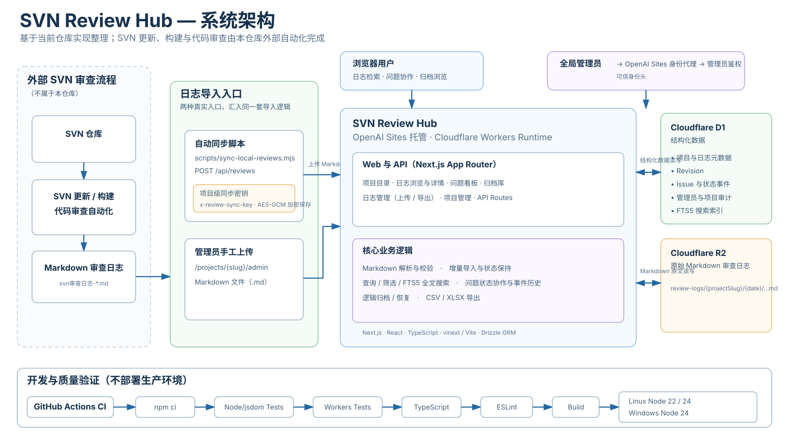

# SVN Review Hub

[](https://github.com/zhoupeixian/zherp-svn-review-portal/actions/workflows/ci.yml)

将 SVN 代码审查 Markdown 日志整理为可检索、可跟踪、可分享的多项目门户。适合开发者查看每日审查结果、跟进问题，也方便管理员统一导入和归档日志。

本项目负责展示和管理审查结果；SVN 更新、构建及代码审查由外部自动化完成，门户接收其输出。

[Docker / 服务器部署](docs/deployment.md) · [本地运行](#本地运行) · [自动同步](#导入和自动同步) · [开发指南](AGENTS.md) · [反馈与贡献](#反馈与贡献)


## 系统架构

<p align="center">
  
</p>

上图展示 Sites / Cloudflare 托管模式。独立服务器与 Docker 复用相同业务流程，运行时改为 Next.js + SQLite，管理员身份改为本地签名会话，详见 [部署指南](docs/deployment.md)。

SVN Review Hub 的职责边界是“接收并管理审查结果”，不是 SVN 客户端或代码审查执行器。SVN 更新、构建和代码审查在本仓库外完成，生成 Markdown 审查日志后再进入门户。

### 托管模式的数据流

```text
┌──────────────────── 本仓库外 ────────────────────┐
│                                                  │
│ SVN 仓库 → SVN 更新 / 构建 / 代码审查自动化      │
│                         │                        │
│                         ▼                        │
│                svn审查日志-*.md                  │
└─────────────────────────┬────────────────────────┘
                          │
              ┌───────────┴────────────┐
              │                        │
       自动同步脚本                管理员手工上传
 sync-local-reviews.mjs          项目日志管理页面
              │                        │
      项目级同步密钥               Sites 管理员身份
              └───────────┬────────────┘
                          ▼
┌──────────────── SVN Review Hub ──────────────────┐
│        OpenAI Sites / Cloudflare Workers         │
│                                                  │
│  Markdown 解析 / 增量导入 / 状态保持             │
│  项目隔离 / 日志查询 / 筛选 / FTS5 搜索          │
│  Issue 协作 / 事件历史 / 逻辑归档与恢复           │
│  CSV / XLSX 导出 / 项目管理与审计                │
└─────────────────┬───────────────────┬────────────┘
                  │                   │
                  ▼                   ▼
        ┌────────────────┐   ┌────────────────┐
        │ Cloudflare D1  │   │ Cloudflare R2  │
        │ 结构化数据     │   │ Markdown 原文 │
        │ 项目/日志      │   │ 审查日志       │
        │ Revision       │   │                │
        │ Issue/事件     │   │                │
        │ FTS5 / 审计    │   │                │
        └────────────────┘   └────────────────┘
```

自动同步脚本只读取外部自动化已经生成的 Markdown，并通过 `POST /api/reviews` 和项目级同步密钥上传；它不会主动访问 SVN。服务端解析日志后，将项目、日志元数据、Revision、Issue、状态事件和搜索索引写入 D1，原始 Markdown 单独保存到 R2。

浏览器用户可进行日志检索、问题协作和归档浏览；管理员身份由 OpenAI Sites 托管环境提供的可信身份头识别。GitHub Actions 验证 Node/jsdom、Workers、SQLite、两种生产构建和容器部署链路；发布工作流提供容器分发，不自动部署服务器。

## 能做什么

- 按项目浏览日志、Revision 和 P1/P2/P3 问题，按条件筛选与搜索。
- 在问题看板记录处理说明，跟踪待处理、待确认、已解决、误判、设计如此、暂不处理六种状态。
- 分享当前筛选链接、查看日志原文，导出日志和问题数据。
- 查看只读归档；管理员可预览并确认归档、恢复日志、手工上传 Markdown。
- 管理项目、启停状态、排序和独立同步密钥，并查看项目管理审计记录。
- 接收本地日志自动同步，展示最近自动同步及相关健康指标。

## 页面与使用流程

| 入口 | 用途 |
| --- | --- |
| `/` | 项目目录 |
| `/projects/{slug}` | 项目日志首页 |
| `/projects/{slug}/issues` | 问题看板 |
| `/projects/{slug}/archive` | 归档库 |
| `/projects/{slug}/reviews/{id}` | 日志详情 |
| `/projects/{slug}/admin` | 项目日志管理，需要管理员身份 |
| `/admin/projects` | 全站项目管理，需要管理员身份 |

从项目目录进入目标项目，筛选日志或问题，打开详情查看原始上下文，再填写问题状态与处理说明。当前问题支持匿名协作；匿名记录不代表经过认证的操作者身份。归档内容只读。旧 `/admin` 等兼容入口对应默认 `zherp` 项目，新集成应优先使用带项目路径的入口。

独立服务器与 Docker 使用 `/login` 的随机管理员密码登录，配置见 [部署指南](docs/deployment.md)。Sites 托管环境使用 ChatGPT 身份。管理员表为空时，首个通过管理员检查的已登录用户会被登记为管理员，后续用户需要已在管理员表中；首次初始化应由项目负责人完成。

## 本地运行

开发与原生部署支持 Node.js **22.13.0+ 的 22 LTS / 24 LTS**、npm 和 Git，推荐 Node.js 24。下面是 Cloudflare 开发环境；希望直接使用项目请按 [独立部署指南](docs/deployment.md) 操作。以下示例使用 PowerShell；已克隆仓库的开发者直接进入现有目录，不要重复克隆。

```powershell
git clone https://github.com/zhoupeixian/zherp-svn-review-portal.git
Set-Location zherp-svn-review-portal
npm ci
if (-not (Test-Path .dev.vars)) { Copy-Item .dev.vars.example .dev.vars }
```

编辑 `.dev.vars`，将占位值换为独立随机密钥：

| 服务端变量 | 用途 |
| --- | --- |
| `ANONYMOUS_SOURCE_HASH_KEY` | 匿名协作来源摘要，至少 32 个字符 |
| `REVIEW_SYNC_MASTER_KEY` | 加密项目同步密钥，32 字节随机值的 Base64；妥善备份，丢失后无法恢复已有密钥 |

随后启动：

```powershell
npm run dev
```

访问终端实际输出的本地地址。`vite.config.ts` 根据 [.openai/hosting.json](.openai/hosting.json) 配置本地 Cloudflare 模拟环境，D1 绑定为 `DB`，R2 绑定为 `FILES`；本地状态保存在 `.wrangler` 等忽略目录中。数据库访问会通过 `ensureReviewSchema()` 初始化和兼容升级审查表。

上述 Cloudflare 开发路径的 `/signin-with-chatgpt` 等登录入口依赖 Sites 可信代理；独立部署改用本地签名会话，不信任托管身份头。仓库没有通用 Wrangler 一键部署脚本，现有 Sites 部署继续使用原平台流程。

## 导入和自动同步

少量日志可在项目管理页手工上传。持续同步使用 [scripts/sync-local-reviews.mjs](scripts/sync-local-reviews.mjs)，配置样例见 [.env.example](.env.example)。

脚本默认读取 `$HOME/.codex/automations/zherp/review-portal.env`，也可通过 `REVIEW_PORTAL_CONFIG` 指定文件；已有进程环境变量优先。**脚本不会自动读取仓库根目录的 `.env`**，如使用它须显式指定。

| 同步端变量 | 是否必需 | 含义 |
| --- | --- | --- |
| `REVIEW_PORTAL_URL` | 是 | 目标站点地址 |
| `REVIEW_PORTAL_PROJECT_SLUG` | 是 | 目标项目标识，如 `zherp` |
| `REVIEW_PORTAL_SYNC_KEY` | 是 | 该项目的同步密钥，从项目管理获得 |
| `REVIEW_LOG_ROOT` | 是 | 本地审查日志根目录 |
| `REVIEW_PORTAL_DISPATCH_TOKEN` | 否 | 私有 Sites 站点的服务访问令牌 |

```powershell
# 先按 .env.example 准备本地 .env，填写实际配置
$env:REVIEW_PORTAL_CONFIG = Join-Path (Get-Location) '.env'
npm run sync:reviews -- --date 2026-09-12
```

此命令会向目标站点写入日志。指定日期时扫描 `<REVIEW_LOG_ROOT>/<日期>/`，不指定时递归扫描整个根目录；仅接收文件名为 `svn审查日志-*.md` 的文件。脚本以相对路径作为 `sourceKey`，通过 `POST /api/reviews` 携带项目标识及 `x-review-sync-key` 上传。同项目、同来源重复导入会合并日志，保留已有问题的处理状态及历史。

服务端主密钥不要复制到同步主机。实际 `.env`、`.dev.vars`、访问令牌和日志中的敏感信息不要提交到仓库。

## 构建与检查

```powershell
npm run test:ci
npm run typecheck
npm run lint
npm run build
```

Cloudflare 生产构建使用 vinext/Vite，产物写入 `dist`。`npm run start` 启动构建产物；构建成功不代表线上 D1/R2、登录或域名已配置。完整测试命令见 [AGENTS.md](AGENTS.md#测试与验证)，测试必须分 Node/jsdom 与 Workers 两种环境。

已有部署可执行只读冒烟检查：

```powershell
$env:REVIEW_PORTAL_URL = 'https://your-review-portal.example'
npm run smoke:production
```

冒烟命令直接读取进程环境变量，依次检查首页、旧管理地址重定向、项目管理入口认证保护、默认 `zherp` 项目只读 API；不发送 Cookie、同步密钥或服务令牌。退出码 `0` 为通过、`1` 为检查失败、`2` 为配置错误；私有站点的外层访问保护可能使检查无法通过。

## 技术与开发文档

React 19、Next.js App Router、TypeScript、Tailwind CSS 4。Cloudflare 模式经 vinext/Vite 运行，使用 D1 + R2；独立模式经 Next.js standalone 运行，使用 SQLite 同时保存结构化数据和原文。两种模式共享业务实现，Drizzle 管理 schema 和迁移历史。

独立模式另执行 `npm run test:server`、`npm run build:server` 和 `npm run verify:server`；后者启动全新本机实例并验证登录、同步、隔离、重启与备份恢复。

- [部署、升级与备份恢复](docs/deployment.md)：Docker Compose、原生服务器、HTTPS 与配置。
- [贡献流程](CONTRIBUTING.md) 与 [安全政策](SECURITY.md)。
- [开发代理与开发者指南](AGENTS.md)：源码地图、业务约束、测试分流、修改边界。
- [版本发布流程](docs/release/README.md)：CI、测试报告、Release 草稿与部署边界。
- [历史设计与计划](docs/superpowers/)：理解早期设计，不作为当前功能清单。
- [1.0 历史验证记录](docs/release/review-portal-1-0-validation.md)：仅代表记录日期的版本，导出格式和测试数量等以当前代码为准。

修改功能、运行命令或配置时，请同步更新本文和开发指南中受影响的说明。

## 反馈与贡献

项目由 [zhoupeixian](https://github.com/zhoupeixian) 及仓库贡献者维护。使用问题、缺陷和功能建议请通过 [GitHub Issues](https://github.com/zhoupeixian/zherp-svn-review-portal/issues) 提交，先检索是否已有相同问题。

- 缺陷报告请包含版本或提交号、运行环境、复现步骤、预期与实际结果，以及脱敏后的日志或截图。不要公开同步密钥、访问令牌或业务敏感原文。
- 开发前阅读 [AGENTS.md](AGENTS.md)，较大的功能或行为调整先在 Issue 中说明范围；提交 PR 时保持修改集中，并列明验证命令、结果及未验证部分。
- 文档修改检查链接、命令和配置说明；代码修改运行相关回归测试，并按影响补充类型检查、lint、构建和浏览器验证。

## 许可证

本项目采用 [MIT 许可证](LICENSE)。Copyright (c) 2026 zhoupeixian。第三方依赖仍遵循各自许可证。
